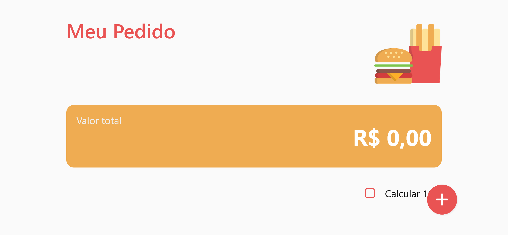
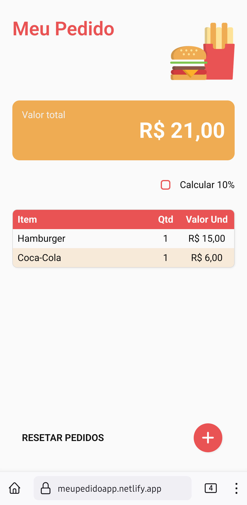
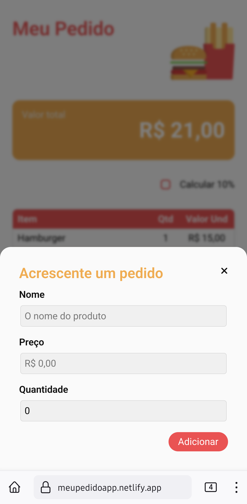
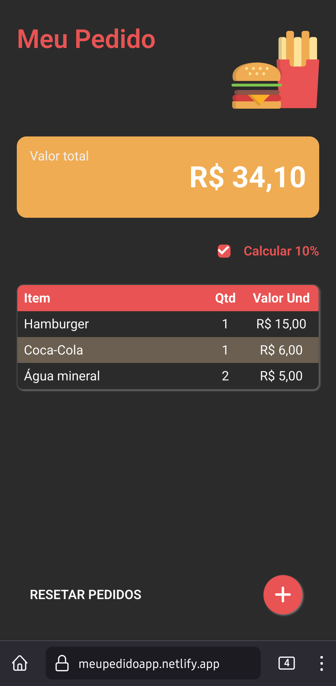

# Meu Pedido

Este é um projeto pessoal, feito em React. Ele serve para conferir você mesmo quanto está dando a sua conta ou a sua parte da conta, quando você vai dividir com mais alguém e evitar surpresas desagradáveis.

## 🤳 Telas






## 📋 Funcionalidades

No **Meu Pedido** você pode:

- adicionar um item à lista de pedidos para acompanhar com o nome, o preço e quantidade; o resto fica por conta dele;
- acrescenter os 10% da gorjeta ao cálculo.

Além disso, o modo escuro é automático respeitando a sua preferência.

## 🔨 Tecnologias utilizadas

- React (Vite)
- JavaScript
- [React Currency Input Field Component](https://www.npmjs.com/package/react-currency-input-field)
  
## 💻 Como acessar online

O deploy do projeto foi feito pelo [Netilify](https://www.netlify.com/) e está disponível em https://meupedidoapp.netlify.app/

## ⌨️ Como rodar localmente

Este projeto foi criado usando [Vite](https://vite.dev), portanto você pode seguir a documentação desse script para fazer deploy do site localmente.

No caso, primeiro você precisará baixar o projeto executando o seguinte comando no terminal:

```
git clone https://github.com/RenanSantos7/Meu-Pedido.git
```

Depois de acessar a pasta em que ele foi baixado, instale as dependências rodando:

```
npm i
```

E por fim rode o projeto com:

```
npm run dev
```

O terminal mostrará o endereço para acessar o site no qual você pode clicar para abri-lo. Você também pode apertar `o` e depois `Enter` para fazer isso.

Você também poderá abri-lo no celular acessando o endereço que aparece após 'Network:' no terminal

## Licensa

O projeto está disponível publicamente com [licença não comercial](./LICENSE.md)